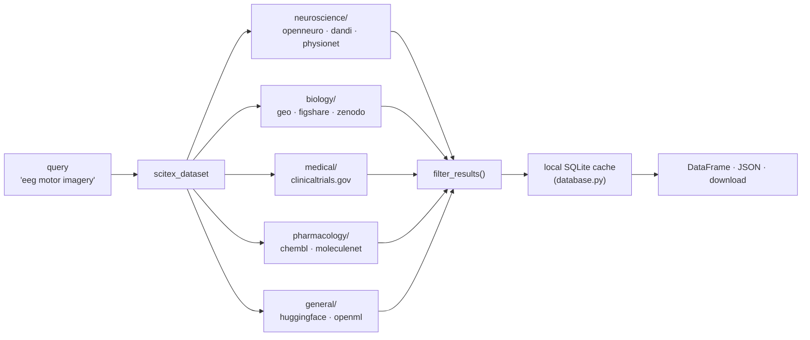

# SciTeX Dataset (<code>scitex-dataset</code>)

<p align="center">
  <a href="https://scitex.ai">
    
  </a>
</p>

<p align="center"><b>Unified access to neuroscience and scientific datasets</b></p>

<p align="center">
  <a href="https://scitex-dataset.readthedocs.io/">Full Documentation</a> · <code>uv pip install scitex-dataset[all]</code>
</p>

<!-- scitex-badges:start -->
<p align="center">
  <a href="https://pypi.org/project/scitex-dataset/"></a>
  <a href="https://pypi.org/project/scitex-dataset/"></a>
  <a href="https://github.com/ywatanabe1989/scitex-dataset/actions/workflows/rtd-sphinx-build-on-ubuntu-latest.yml"></a>
</p>
<p align="center">
  <a href="https://github.com/ywatanabe1989/scitex-dataset/actions/workflows/pytest-matrix-on-ubuntu-py3-11-3-12-3-13.yml"></a>
  <a href="https://codecov.io/gh/ywatanabe1989/scitex-dataset"></a>
</p>
<!-- scitex-badges:end -->

---

## Problem and Solution

| # | Problem | Solution |
|---|---------|----------|
| 1 | **Public dataset repositories balkanized** -- OpenNeuro (BIDS) + DANDI (NWB) + PhysioNet (WFDB) + Zenodo (generic) + GEO / ChEMBL / ClinicalTrials — different APIs, auth, download tools | **Unified fetcher** -- `stx.dataset.neuroscience.openneuro.fetch_all_datasets()` same call shape across all; local FTS5 search across metadata |
| 2 | **"Download this BIDS dataset" means reading DataLad docs first** -- the barrier is tooling, not knowledge | **One-line fetch** -- no DataLad setup; the module handles auth, resumption, checksums transparently |

## Supported repositories

| Domain | Repository | Description | Data Types |
|--------|------------|-------------|------------|
| neuroscience | **OpenNeuro** | Open BIDS neuroimaging platform | MRI, EEG, MEG, iEEG, PET |
| neuroscience | **DANDI** | BRAIN Initiative archive (NWB) | Electrophysiology, Ophys |
| neuroscience | **PhysioNet** | Physiological signal databases | ECG, EEG, clinical data |
| neuroscience | **GIN** | G-Node Infrastructure (Gogs + git-annex) | iEEG, ephys, behaviour |
| general | **Zenodo** | General scientific data (CERN) | Any research data |
| general | **Figshare** | Research data sharing platform | Any research data |
| general | **OpenML** | Machine-learning datasets | Tabular ML benchmarks |
| general | **HuggingFace Hub** | ML datasets / models (on-demand) | Any |
| biology | **GEO** | Gene Expression Omnibus (NCBI) | Transcriptomics, microarray |
| pharmacology | **MoleculeNet** | Molecular ML benchmark suite | SMILES, properties |
| pharmacology | **ChEMBL** | Bioactivity database (EBI) | IC50/Ki/EC50 assays |
| medical | **ClinicalTrials.gov** | NIH study registry | Trial metadata |

<p align="center"><sub><b>Table 1.</b> Supported data repositories. Each source is queried via its public API; no authentication required for metadata access.</sub></p>

## Installation

Requires Python >= 3.10.

```bash
pip install scitex-dataset
```

> **MCP support**: `pip install scitex-dataset[mcp]`

<details>
<summary><strong>Targeting a specific Python (agent containers, system venvs, Spartan modules)</strong></summary>

<br>

When the host has multiple Python interpreters — e.g. a pre-built
agent venv at `/opt/venv-agent`, a Spartan `module load Python/3.11.3`,
or an existing `~/.venv` you want to leave alone — point `uv` at the
exact interpreter you want with `--python`:

```bash
# install into a specific venv WITHOUT touching project-local .venv
uv pip install --python /opt/venv-agent/bin/python "scitex-dataset[all]"

# one-shot CLI run under that interpreter
uv run --python /opt/venv-agent/bin/python scitex-dataset list-python-apis

# install the CLI as a tool, pinned to the same interpreter
uv tool install --python /opt/venv-agent/bin/python "scitex-dataset[mcp]"

# in a downstream script that bootstraps scitex-dataset, honour
# SCITEX_PYTHON if the caller sets it:
SCITEX_PYTHON="${SCITEX_PYTHON:-/opt/venv-agent/bin/python}"
uv pip install --python "$SCITEX_PYTHON" "scitex-dataset[all]"
```

The Makefile honours `PYTHON=`:

```bash
PYTHON=/opt/venv-agent/bin/python make install
```

See issue [#38](https://github.com/ywatanabe1989/scitex-dataset/issues/38).

</details>

## Architecture

```
scitex_dataset/
├── __init__.py            ← public API (every *_fetch + filter/list_sources)
├── __main__.py            ← `python -m scitex_dataset`
├── _api.py                ← unified fetch dispatch
├── _sources.py            ← source registry (id → fetcher)
├── _config.py             ← PriorityConfig (cli > yaml > env > default)
├── _branding.py           ← CLI banner / version helpers
├── database.py            ← local SQLite cache (db_build / db_search)
├── search.py              ← cross-source search + filter_results
├── neuroscience/          ← openneuro, dandi, physionet
├── biology/               ← geo, figshare, zenodo
├── medical/               ← clinicaltrials.gov
├── pharmacology/          ← chembl, moleculenet
├── general/               ← huggingface, openml
├── _cli/                  ← `scitex-dataset` CLI (Click groups)
├── _mcp/                  ← MCP server tools
└── _skills/               ← agent-facing skill files
```

Sub-packages group fetchers by scientific domain; each leaf module
exposes a `<source>_fetch(query, ...)` entry point registered in
`_sources.py` and re-exported from `__init__.py`.

## Four Interfaces (Python · CLI · MCP · Skills)

<details open>
<summary><strong>Python API ⭐⭐⭐ (primary)</strong></summary>

<br>

```python
from scitex_dataset import (
    openneuro_fetch, dandi_fetch, huggingface_search,
    filter_results, list_sources,
    db_build, db_search,
)

# 1) Fetch from any catalog source — every <src>_fetch alias is 1:1
#    with the dataset_<src>_fetch MCP tool.
records = openneuro_fetch(max_datasets=100)

# 2) Filter + rank in memory.
top = filter_results(
    records, modality="eeg", min_subjects=20,
    sort_by="downloads", limit=10,
)

# 3) Search HuggingFace Hub directly (on-demand, no catalog).
hf_hits = huggingface_search("biology", limit=20)

# 4) Build the local SQLite + FTS5 index for offline queries.
db_build()
db_search("Alzheimer EEG")

# 5) Inspect the supported sources.
list_sources()["count"]   # 11
```

> **[Full API reference](https://scitex-dataset.readthedocs.io/en/latest/api/scitex_dataset.html)**

</details>

<details>
<summary><strong>CLI Commands ⭐⭐</strong></summary>

<br>

```bash
scitex-dataset --help-recursive             # Show all commands

# Grammar: scitex-dataset <domain> <dataset> <action>
scitex-dataset neuroscience openneuro fetch -n 100 -o datasets.json -v
scitex-dataset neuroscience dandi fetch -n 50 -o dandi.json -v
scitex-dataset neuroscience physionet fetch -n 50 -v
scitex-dataset general zenodo fetch -q "neuroscience" -n 20

# HuggingFace (general/huggingface noun-group has 4 verbs)
scitex-dataset general huggingface fetch Anthropic/BioMysteryBench-full
scitex-dataset general huggingface search "biology" -n 20 --json

# Local database
scitex-dataset db build                     # index all catalog sources
scitex-dataset db search "epilepsy EEG"     # full-text search
scitex-dataset db show-stats                # show statistics

# Introspection
scitex-dataset list-python-apis -v          # list Python API tree
scitex-dataset mcp list-tools -v            # list MCP tools
```

> **[Full CLI reference](https://scitex-dataset.readthedocs.io/en/latest/quickstart.html)**

</details>

<details>
<summary><strong>MCP Server ⭐⭐</strong></summary>

<br>

AI agents can discover and query neuroscience datasets autonomously.

| Tool | Description |
|------|-------------|
| `dataset_list_sources` | Enumerate the 11 supported sources |
| `dataset_filter_results` | Filter / rank fetched datasets in memory |
| `dataset_<src>_fetch` | One per catalog source (10 total) |
| `dataset_huggingface_fetch` / `_search` / `_info` / `_download_file` | HuggingFace family |
| `dataset_db_build` / `_search` / `_show_stats` | Local SQLite + FTS5 index |
| `dataset_skills_list` / `_get` | Bundled skill pages |

<sub><b>Table 2.</b> 21 MCP tools across catalog fetchers, HuggingFace,
the local index, and skill introspection. Every MCP tool has a matching
public Python alias (e.g. ``scitex_dataset.openneuro_fetch``).</sub>

```bash
scitex-dataset mcp start
```

> **[Full MCP specification](https://scitex-dataset.readthedocs.io/en/latest/api/scitex_dataset._mcp.html)**

</details>

<details>
<summary><strong>Skills ⭐</strong></summary>

<br>

Skills provide workflow-oriented guides that AI agents query to discover capabilities and usage patterns.

```bash
scitex-dataset skills list              # List available skill pages
scitex-dataset skills get SKILL         # Show main skill page
scitex-dev skills export --package scitex-dataset  # Export to Claude Code
```

| Skill | Content |
|-------|---------|
| `installation` | pip install + extras + verify |
| `quick-start` | Search, fetch, sort across sources |
| `python-api` | Top-level exports, domain submodules, examples |
| `cli-reference` | CLI grammar, domains, flags, config precedence |
| `mcp-tools` | MCP tools for AI agents |
| `env-vars` | SCITEX_* environment variables |
| `data-sources` | All 11 supported repositories |

</details>

## Demo



## Part of SciTeX

`scitex-dataset` is part of [**SciTeX**](https://scitex.ai). Install via
the umbrella with `pip install scitex[dataset]` to use as
`scitex.dataset` (Python) or `scitex dataset ...` (CLI).

```python
import scitex
from scitex_dataset import fetch_all_datasets, format_dataset

@scitex.session
def main(logger=scitex.INJECTED):
    datasets = fetch_all_datasets(max_datasets=100, logger=logger)
    formatted = [format_dataset(ds) for ds in datasets]
    scitex.io.save(formatted, "openneuro_datasets.json")
    return 0
```

The SciTeX ecosystem follows the Four Freedoms for Research, inspired by [the Free Software Definition](https://www.gnu.org/philosophy/free-sw.en.html):

>Four Freedoms for Research
>
>0. The freedom to **run** your research anywhere -- your machine, your terms.
>1. The freedom to **study** how every step works -- from raw data to final manuscript.
>2. The freedom to **redistribute** your workflows, not just your papers.
>3. The freedom to **modify** any module and share improvements with the community.
>
>AGPL-3.0 -- because we believe research infrastructure deserves the same freedoms as the software it runs on.

---

<p align="center">
  <a href="https://scitex.ai" target="_blank"></a>
</p>

<!-- EOF -->
